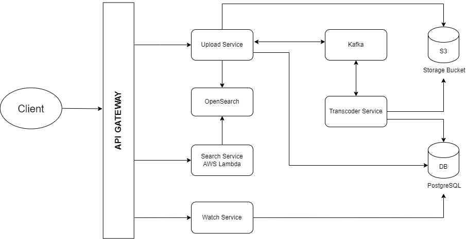

# Youtube - Video Streaming App

### Designed and Implemented a Youtube Clone Application where Users can upload and watch Videos.

### Tech Stack Used

```
Next JS, Node JS, Kafka, PostgreSQL, OpenSearch, AWS S3Bucket
```

### Microservices
- Upload Service
- Watch Service
- Transcoding Service
- Search Service

### Functional Requirements
- Authentication: User Login and Logout with Google OAuth
- Video Upload to S3 (Chunking)
- Transcoding the video to different qualities
- Adaptive Bitrate Streaming
- Search Videos

### Non Functional Requirements
- Availability
- Low Latency

## Architecture


